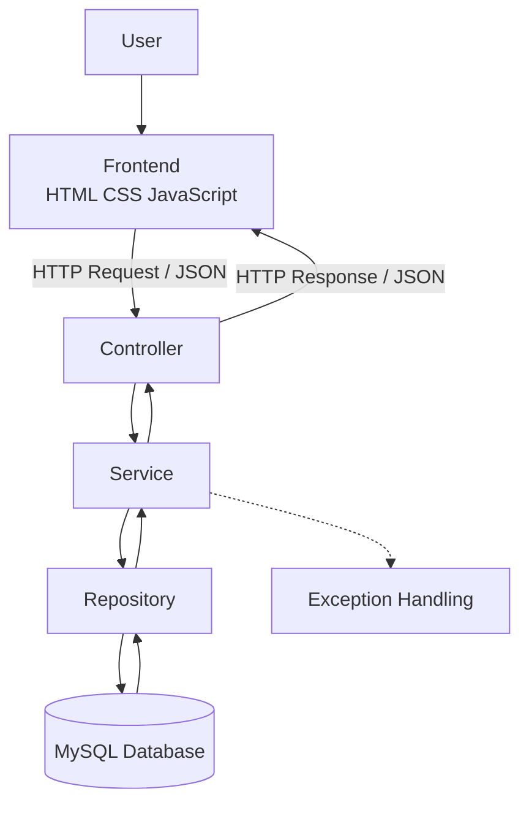
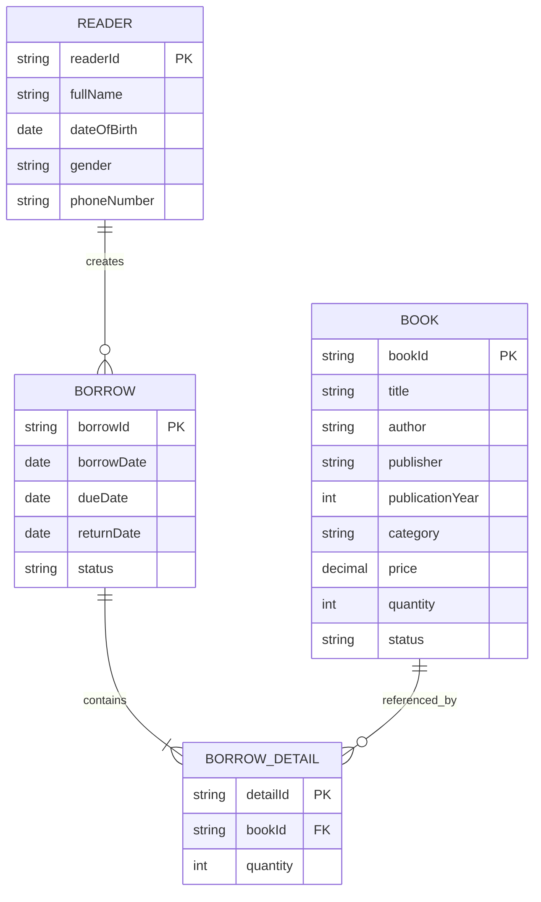

# System Architecture — Library Management System

## 1. Tổng quan hệ thống

Library Management System là hệ thống quản lý thư viện được xây dựng nhằm hỗ trợ quản lý sách, độc giả, hoạt động mượn và trả sách.

Hệ thống được phát triển theo mô hình phân lớp (Layered Architecture), giúp tách biệt giao diện, xử lý nghiệp vụ, truy cập dữ liệu và cơ sở dữ liệu.

### Công nghệ sử dụng

| Thành phần         | Công nghệ                  |
| ------------------ | -------------------------- |
| Ngôn ngữ lập trình | Java 21                    |
| Backend            | Spring Boot                |
| ORM / Data Access  | Spring Data JPA, Hibernate |
| Cơ sở dữ liệu      | MySQL                      |
| Frontend           | HTML, CSS, JavaScript      |
| Giao tiếp          | REST API                   |
| Build tool         | Maven                      |

## 2. Kiến trúc tổng thể

Hệ thống được chia thành các thành phần chính:

* **Frontend:** Hiển thị giao diện và tiếp nhận thao tác của người dùng.
* **Controller:** Tiếp nhận HTTP request, gọi tầng xử lý nghiệp vụ và trả về HTTP response.
* **Service:** Chứa logic nghiệp vụ, kiểm tra dữ liệu và điều phối các thao tác.
* **Repository:** Thực hiện truy vấn và thao tác với cơ sở dữ liệu thông qua JPA.
* **Entity:** Đại diện cho các đối tượng dữ liệu được lưu trữ trong database.
* **DTO:** Định nghĩa dữ liệu đầu vào và đầu ra của API.
* **Exception handling:** Xử lý lỗi nghiệp vụ và chuyển lỗi thành phản hồi phù hợp.

### Sơ đồ kiến trúc

## 3. Cấu trúc phân lớp

### 3.1. Controller Layer

Controller chịu trách nhiệm tiếp nhận các yêu cầu từ frontend thông qua REST API.

Các nhiệm vụ chính:

* Nhận dữ liệu từ request.
* Gọi phương thức tương ứng trong Service.
* Trả về dữ liệu thông qua DTO.
* Sử dụng HTTP status phù hợp cho kết quả hoặc lỗi.

Controller không nên chứa các đoạn xử lý nghiệp vụ phức tạp hoặc truy vấn database trực tiếp.

### 3.2. Service Layer

Service là tầng xử lý nghiệp vụ chính của hệ thống.

Các nhiệm vụ chính:

* Kiểm tra điều kiện nghiệp vụ.
* Xử lý việc thêm, sửa, tìm kiếm và xóa dữ liệu.
* Điều phối các thao tác giữa nhiều Repository.
* Xử lý nghiệp vụ mượn, trả sách và cập nhật số lượng sách.
* Kiểm tra các điều kiện liên quan đến ngày mượn, hạn trả và trạng thái phiếu.
* Quản lý transaction đối với nghiệp vụ cần nhiều thao tác dữ liệu liên quan.

Những thao tác làm thay đổi nhiều dữ liệu có liên quan nên được quản lý bằng transaction để tránh tình trạng dữ liệu cập nhật không đồng bộ khi xảy ra lỗi.

### 3.3. Repository Layer

Repository chịu trách nhiệm làm việc với cơ sở dữ liệu.

Các nhiệm vụ chính:

* Lấy dữ liệu theo ID.
* Truy vấn danh sách và tìm kiếm dữ liệu.
* Lọc dữ liệu theo điều kiện.
* Lưu mới hoặc cập nhật Entity.
* Thực hiện các truy vấn cần thiết cho nghiệp vụ.

Tầng này sử dụng Spring Data JPA để giảm lượng mã truy vấn dữ liệu phải viết thủ công.

### 3.4. Entity Layer

Entity biểu diễn các đối tượng dữ liệu được ánh xạ với các bảng trong database.

Một số Entity chính:

* `Book`
* `Reader`
* `Borrow`
* `BorrowDetail`

Các Entity chứa thuộc tính dữ liệu và những mối quan hệ cần thiết giữa các đối tượng.

### 3.5. DTO Layer

DTO (Data Transfer Object) được sử dụng để trao đổi dữ liệu giữa frontend và backend.

Các mục đích chính:

* Xác định rõ dữ liệu mà API nhận vào.
* Kiểm soát dữ liệu trả về cho frontend.
* Tránh phụ thuộc trực tiếp vào cấu trúc Entity.
* Hỗ trợ xử lý nghiệp vụ có dữ liệu đầu vào hoặc đầu ra phức tạp.

Đối với nghiệp vụ mượn và trả sách, các DTO có thể biểu diễn thông tin độc giả, danh sách sách được mượn, số lượng, thông tin phiếu và kết quả xử lý trả sách.

## 4. Thiết kế hướng đối tượng (OOP)

Hệ thống sử dụng các nguyên tắc lập trình hướng đối tượng để tổ chức dữ liệu và hành vi.

### 4.1. Đóng gói (Encapsulation)

Các đối tượng quản lý dữ liệu thông qua thuộc tính và phương thức. Những quy tắc nghiệp vụ được đặt trong tầng Service thay vì phân tán tùy tiện ở Controller và frontend.

### 4.2. Trừu tượng hóa (Abstraction)

Các tầng giao tiếp với nhau thông qua những phương thức có trách nhiệm rõ ràng. Controller không cần biết chi tiết truy vấn SQL; Service không cần phụ thuộc vào cách frontend hiển thị dữ liệu.

### 4.3. Tổ chức trách nhiệm

Mỗi lớp có một nhiệm vụ chính:

* Entity biểu diễn dữ liệu.
* DTO biểu diễn dữ liệu trao đổi.
* Controller xử lý giao tiếp HTTP.
* Service xử lý nghiệp vụ.
* Repository xử lý truy cập dữ liệu.

Cách tổ chức này giúp mã nguồn dễ đọc, kiểm thử và bảo trì hơn.

## 5. Thiết kế dữ liệu và quan hệ Entity

### 5.1. Các Entity chính

| Entity         | Trách nhiệm                                        |
| -------------- | -------------------------------------------------- |
| `Book`         | Lưu thông tin sách, giá, số lượng và trạng thái    |
| `Reader`       | Lưu thông tin độc giả                              |
| `Borrow`       | Lưu thông tin chung của phiếu mượn                 |
| `BorrowDetail` | Lưu từng đầu sách và số lượng thuộc một phiếu mượn |

### 5.2. Quan hệ giữa các Entity

* Một `Reader` có thể có nhiều `Borrow`.
* Một `Borrow` có thể chứa nhiều `BorrowDetail`.
* Mỗi `BorrowDetail` tham chiếu đến một `Book`.
* Một `Book` có thể xuất hiện trong nhiều `BorrowDetail` khác nhau.

### Sơ đồ quan hệ

Sơ đồ thể hiện các quan hệ nghiệp vụ ở mức khái quát. Tên khóa, kiểu dữ liệu và các thuộc tính trong sơ đồ cần được đối chiếu với Entity và schema thực tế của dự án.

### 5.3. Xóa mềm (Soft Delete)

Đối với những đối tượng có hỗ trợ xóa mềm, hệ thống sử dụng thuộc tính `is_deleted` để đánh dấu bản ghi đã bị xóa thay vì xóa trực tiếp khỏi database.

Lợi ích:

* Giữ lại dữ liệu để phục vụ đối chiếu.
* Hạn chế mất dữ liệu liên quan đến nghiệp vụ cũ.
* Cho phép các truy vấn thông thường loại trừ bản ghi đã bị xóa.

Các truy vấn và quy tắc nghiệp vụ cần thống nhất cách xử lý bản ghi đã bị xóa.

## 6. Enum và trạng thái nghiệp vụ

Enum được sử dụng để giới hạn các giá trị trạng thái hợp lệ, tránh sử dụng các chuỗi tùy ý trong toàn bộ chương trình.

Ví dụ về những nhóm trạng thái trong hệ thống:

* **BookStatus:** Biểu diễn trạng thái sách.
* **BorrowStatus:** Biểu diễn trạng thái phiếu mượn.
* **Trạng thái độc giả:** Chỉ bổ sung nếu dự án thực sự định nghĩa enum này.

Đối với phiếu mượn, các trạng thái nghiệp vụ có thể bao gồm đang mượn, đã trả và quá hạn, tùy theo enum được triển khai.

Việc sử dụng enum giúp mã nguồn dễ đọc và giảm lỗi do nhập sai giá trị trạng thái.

## 7. Luồng xử lý nghiệp vụ

### 7.1. Quản lý sách và độc giả

1. Người dùng thao tác trên giao diện.
2. Frontend gửi request đến Controller.
3. Controller tiếp nhận dữ liệu và gọi Service.
4. Service kiểm tra điều kiện nghiệp vụ.
5. Repository truy vấn hoặc cập nhật database.
6. Backend trả kết quả qua DTO để frontend hiển thị.

### 7.2. Lập phiếu mượn sách

1. Frontend gửi thông tin độc giả và danh sách sách cần mượn.
2. Controller tiếp nhận request mượn sách.
3. Service kiểm tra độc giả, sách và số lượng có thể mượn.
4. Service tạo phiếu mượn và các chi tiết mượn tương ứng.
5. Hệ thống cập nhật dữ liệu liên quan đến số lượng sách theo quy tắc nghiệp vụ.
6. Các thay đổi dữ liệu được thực hiện trong transaction khi cần thiết.
7. Backend trả thông tin phiếu mượn cho frontend.

Nếu có lỗi trong quá trình xử lý, hệ thống cần tránh để lại phiếu mượn hoặc số lượng sách ở trạng thái không nhất quán.

### 7.3. Trả sách

1. Frontend gửi yêu cầu trả sách kèm thông tin xử lý từng đầu sách.
2. Service kiểm tra phiếu mượn và dữ liệu trả sách.
3. Hệ thống xác định số lượng sách được trả, hỏng hoặc mất theo nghiệp vụ.
4. Hệ thống tính phí phát sinh nếu có quy tắc tính phí tương ứng.
5. Dữ liệu phiếu mượn, chi tiết mượn và số lượng sách được cập nhật phù hợp.
6. Khi toàn bộ sách đã được xử lý, phiếu được chuyển sang trạng thái đã trả.
7. Backend trả kết quả để frontend cập nhật giao diện.

Các bước trên mô tả luồng nghiệp vụ tổng quát. Chi tiết tính phí, thanh toán và cập nhật kho phải tuân theo logic được triển khai thực tế trong Service.

### 7.4. Theo dõi phiếu quá hạn

Hệ thống sử dụng ngày đến hạn trả và trạng thái phiếu để xác định các phiếu quá hạn.

Danh sách phiếu có thể được tìm kiếm, lọc theo trạng thái và sắp xếp theo những tiêu chí được API hỗ trợ.

## 8. Xử lý ngoại lệ

Hệ thống sử dụng các ngoại lệ nghiệp vụ để biểu diễn những tình huống không thể xử lý theo yêu cầu.

Ví dụ:

* `ResourceNotFoundException`: Không tìm thấy tài nguyên được yêu cầu.
* `ConflictException`: Dữ liệu hoặc thao tác vi phạm điều kiện nghiệp vụ.
* `ErrorResponse`: Cấu trúc phản hồi lỗi gửi về client.

Các ngoại lệ được xử lý tại cơ chế xử lý lỗi của backend để trả về thông tin phù hợp.

Nguyên tắc:

* Không trả về stack trace hoặc thông tin nội bộ nhạy cảm cho frontend.
* Thông báo lỗi cần dễ hiểu và phù hợp với tình huống.
* Sử dụng HTTP status tương ứng với loại lỗi.
* Tránh lặp lại logic xử lý lỗi ở nhiều Controller.

## 9. Giao tiếp giữa Frontend và Backend

Frontend giao tiếp với backend thông qua REST API.

* Request thường sử dụng JSON đối với dữ liệu tạo mới hoặc cập nhật.
* Backend tiếp nhận dữ liệu, xử lý nghiệp vụ và trả response.
* DTO được sử dụng để thống nhất cấu trúc dữ liệu trao đổi.
* Frontend hiển thị kết quả và thông báo lỗi dựa trên response từ backend.

Các endpoint, HTTP method và cấu trúc request/response cụ thể được mô tả trong tài liệu API nếu có.

## 10. Nguyên tắc thiết kế

Hệ thống hướng đến các nguyên tắc:

1. **Separation of Concerns:** Mỗi tầng có trách nhiệm riêng.
2. **Single Responsibility:** Mỗi lớp nên tập trung vào một nhiệm vụ chính.
3. **Maintainability:** Dễ sửa đổi và mở rộng nghiệp vụ.
4. **Consistency:** Dữ liệu liên quan được cập nhật nhất quán.
5. **Reusability:** Tái sử dụng các phương thức nghiệp vụ và truy vấn khi phù hợp.
6. **Error Handling:** Xử lý lỗi tập trung và có thông báo rõ ràng.
7. **Data Integrity:** Bảo đảm tính toàn vẹn dữ liệu thông qua ràng buộc và transaction phù hợp.

## 11. Hướng phát triển

Các hướng mở rộng có thể xem xét trong tương lai:

* Bổ sung kiểm thử đơn vị và kiểm thử tích hợp.
* Hoàn thiện tài liệu API.
* Bổ sung phân quyền người dùng nếu yêu cầu nghiệp vụ cần thiết.
* Cải thiện logging và theo dõi lỗi.
* Tối ưu truy vấn khi dữ liệu tăng lên.
* Bổ sung báo cáo thống kê hoạt động thư viện.
